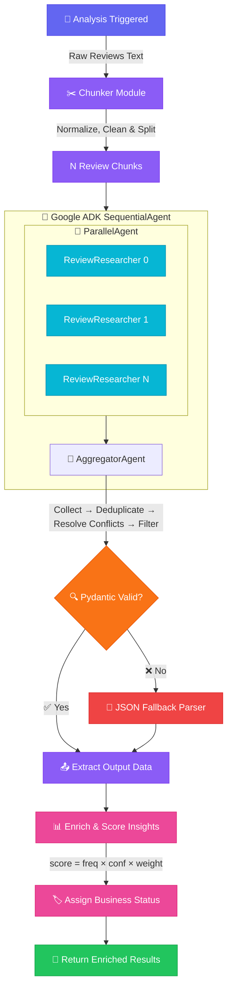
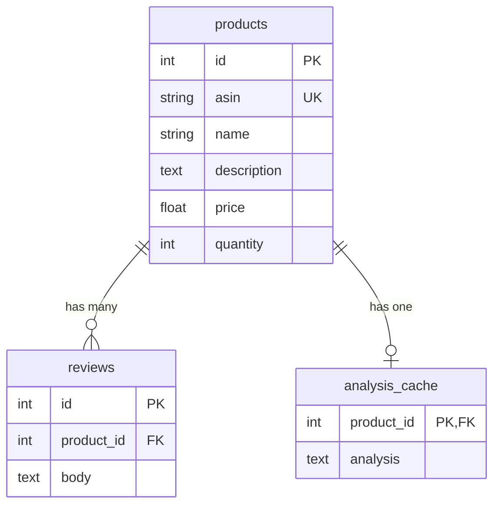

# Product Review Intelligence Platform — Technical Documentation

> Comprehensive technical documentation covering architecture, components, data flow, API surface, and deployment.

---

## 1. Executive Summary

### The Problem
The massive volume of unstructured customer reviews makes manual analysis inefficient for businesses trying to extract actionable insights. Large Language Models (LLMs) struggle to analyze thousands of reviews simultaneously due to input context limits, potential hallucinations, and high API token costs.

### The Solution
Our team resolves this using a **divide-and-conquer AI-based pipeline**. Instead of sending all reviews to an LLM at once, the system:
1. Chunks reviews into manageable blocks (default: 200 per chunk)
2. Distributes them across parallel sub-agents to extract localized insights
3. Runs a centralized Aggregator Model to synthesize, deduplicate, score, and rank the findings

---

## 2. Technical Architecture & Data Flow

### 2.1 Pipeline Flow



> **⚠️ Rate Limit Protection:** All LLM calls pass through a custom Rate Limit Manager — batched processing (4 req/batch), 60s cooldowns, 2s inter-request delays, and intelligent retry parsing via LiteLLM.

### 2.2 Database Schema (SQLite + SQLAlchemy)



---

## 3. Working Components

### 3.1 Request Handler (FastAPI)

The FastAPI app (`app/main.py`) uses a lifespan context manager and registers three routers:

| Router | Prefix | Endpoints | Description |
|--------|--------|-----------|-------------|
| **Products** | `/db`, `/products` | `GET /db/products`, `GET /db/product/{id}` | Lists and retrieves products from the SQLite database |
| **Reviews** | `/reviews` | `GET /{product_id}`, `POST /{product_id}` | Fetches or submits reviews. Adding a review auto-invalidates the analysis cache |
| **Insights** | `/analyze` | `GET /{product_id}`, `GET /{product_id}/stream`, `DELETE /{product_id}/cache` | Primary analysis endpoints with streaming support (NDJSON) |

**Streaming Events Flow:**
```
init → processing (chunk 1/N) → processing (chunk 2/N) → ... → aggregating → completed
```

### 3.2 Chunking Module (`app/services/chunkers.py`)

Splits the unstructured text block into smaller, manageable chunks to prevent LLM context-window exhaustion. The process:
1. **Normalize** — Lowercases all text and strips excess whitespace
2. **Split** — Divides the review list into blocks of `chunk_size` (default: 200)

### 3.3 Parallel Research Agents (`app/services/parallel_agent.py`)

The system dynamically instantiates N sub-agents (one per chunk) running in parallel using `google.adk.agents.ParallelAgent`:
- Each `ReviewResearcher_{i}` agent extracts business-relevant insights with confidence levels, frequencies, quotes, and categories
- Prompts enforce **strict raw JSON output** and suppress `<think>` reasoning tags
- Each agent writes its output to a keyed variable (`insights_{i}`) consumed by the aggregator

### 3.4 Synthesis & Aggregator Model (`app/services/aggregator_agent.py`)

The `AggregatorAgent` receives all sub-agent outputs and executes a **4-stage synthesis prompt**:

| Stage | Action |
|-------|--------|
| **1. Collect** | Gather all raw insights from every chunk |
| **2. Deduplicate** | Merge similar insights, increment frequency counters, pick best representative quote |
| **3. Resolve Conflicts** | Contradictory insights (e.g., "good battery" vs "bad battery") → merged into a single "Mixed Feedback" item with summed frequencies and averaged confidences |
| **4. Quality Filter** | Retain all valid product feedback; only discard blank, unrelated, or gibberish entries |

### 3.5 Backend Post-Processing & Scoring (`app/services/analysis_service.py`)

After the LLM generates the aggregated JSON, the Python backend enriches each insight with:

**Priority Score Formula:**

$$\text{score} = \text{frequency} \times \text{confidence} \times \text{category\_weight}$$

**Category Weights:**

| Category | Weight | Rationale |
|----------|--------|-----------|
| `quality` | 1.5 | Product quality issues are highest priority |
| `usability` | 1.3 | UX issues directly impact retention |
| `support` | 1.2 | Support problems affect brand perception |
| `price` | 1.0 | Baseline weight |
| `other` | 1.0 | Baseline weight |

**Business Status Bucketing:**

| Score Range | Status | Meaning |
|-------------|--------|---------|
| ≥ 8.0 | 🔴 Needs attention | Critical issue requiring immediate action |
| ≥ 5.0 | 🟡 Worth watching | Emerging trend to monitor |
| < 5.0 | 🟢 Working well | Positive or low-impact feedback |

**Resilience Layers:**
- `_extract_output_data()` — Universal adapter supporting Pydantic V1, V2, raw dict, and list output formats
- `_extract_json_fallback()` — Brace-counting parser that safely extracts JSON from malformed LLM text (markdown wrappers, preamble text, etc.)
- Field normalization maps alternative keys (e.g., `count` → `frequency`, `quote` → `example_quote`)

### 3.6 Caching Layer (SQLite3)

The `analysis_cache` table ensures repeat requests skip the entire LLM pipeline:
- **Cache hit** → instant response (0ms LLM cost)
- **Cache miss** → full pipeline execution, results cached for future requests
- **Auto-invalidation** → adding a new review via `POST /reviews/{id}` automatically clears the cache for that product

---

## 4. The Technology Stack

| Layer | Technology | Purpose |
|-------|-----------|---------|
| **Backend** | FastAPI + Uvicorn | Async REST API with streaming support |
| **Orchestration** | Google ADK | Agent Development Kit for SequentialAgent / ParallelAgent orchestration |
| **Model Router** | LiteLLM | Unified interface for LLM providers with retry policies and rate limit management |
| **LLM Provider** | Groq Cloud API | Fast inference with `meta-llama/llama-4-scout-17b-16e-instruct` |
| **Database** | SQLite3 + SQLAlchemy | Product/review storage and analysis caching (NullPool for zero idle connections) |
| **Validation** | Pydantic V2 | Strict schema enforcement for LLM outputs |
| **Frontend** | Streamlit | Interactive dashboard with real-time streaming progress |
| **Hosting** | Render | Cloud deployment |

---

## 5. Development Setup & Quickstart

### Prerequisites
- Python 3.10+
- A [Groq API Key](https://console.groq.com)

### Installation

```bash
# 1. Create and activate virtual environment
python3 -m venv .venv
source .venv/bin/activate

# 2. Install dependencies
pip install -r requirements.txt
```

### Configuration (`.env`)

```env
GROQ_API_KEY=your_groq_api_key

# Models
LOCAL_MODEL_NAME=groq/meta-llama/llama-4-scout-17b-16e-instruct
LOCAL_PARALLEL_MODEL_NAME=groq/meta-llama/llama-4-scout-17b-16e-instruct

# Rate Limiting
LOCAL_CONCURRENCY_LIMIT=4

# Generation Config
MODEL_TEMPERATURE=0.0
MODEL_SEED=42
MODEL_TOP_P=1.0
MODEL_MAX_TOKENS=8192
PARALLEL_MODEL_MAX_TOKENS=4096
```

### Launch

```bash
# Terminal 1 — Backend
uvicorn app.main:app --reload

# Terminal 2 — Frontend
streamlit run streamlit_app.py
```

---

## 6. Team Members

- **Muhsil NR**
- **Adwaith S Dileep**
- **Vigin PV**
- **Afeefa CS**
- **Ranjana NR**
- **SifaMol M N**
