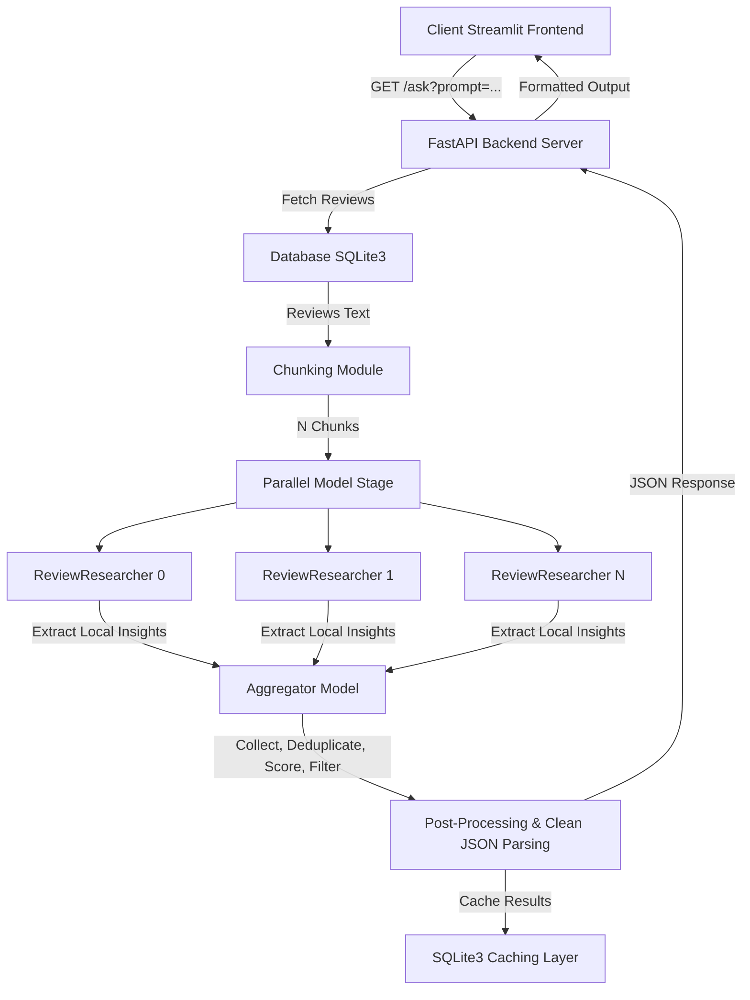

# Product Review Intelligence Platform

This document provides comprehensive technical documentation for the project. It details the problem statement, the system architecture, component details, the updated tech stack, and setup instructions.

---

## 1. Executive Summary

### The Problem
The massive volume of unstructured customer reviews makes manual analysis inefficient for businesses trying to extract actionable insights. Large Language Models (LLMs) struggle to analyze thousands of reviews simultaneously due to input context limits, potential hallucinations, and high API token costs.

### The Solution
Our Team resolves this using a **divide-and-conquer AI based pipeline**. Instead of sending all reviews to an LLM at once, the system chunks reviews (e.g., into blocks of 10–100 reviews), distributes them across parallel sub-agents to extract localized business-related insights, and runs a centralized Aggregator Model to synthesize, deduplicate, score, and rank the findings.

---

## 2. Technical Architecture & Data Flow

Below is the execution flow from the client request to the final response:



---

## 3. Working Components

### 1. Request Handler (FastAPI)
The [FastAPI](file:///Users/muhsilnr/Library/Mobile%20Documents/com~apple%20CloudDocs/Documents/codespace/litmus7_project/main.py) endpoint receives review text via the `/ask` query parameter. It triggers the lifespan setup, verifies the model provider, and delegates analysis to the model provider layer.

### 2. Chunking Module
Splits the unstructured text block into smaller, manageable chunks of reviews (each review on a separate line) to prevent LLM context-window exhaustion and ensure granular analysis.
- $\le 10$ reviews: Chunk size = 3
- $10 - 100$ reviews: Chunk size = 10
- $> 100$ reviews: Chunk size = 100

### 3. Parallel Research Agents (Google ADK)
The system dynamically instantiates $1 - 4$ sub-agents (one per chunk of reviews) running in parallel using `google.adk.agents.ParallelAgent`. Each sub-agent extracts key business-relevant insights, representative quotes, confidence levels, and categories.

### 4. Synthesis & Aggregator Model
The `AggregatorModel` receives the output from all sub-models and processes it to synthesize the findings via a 4-stage LLM prompt:
1. **Collect**: Gather all raw insights.
2. **Deduplicate**: Merge highly similar or duplicate insights, incrementing frequency counters and selecting representative quotes.
3. **Resolve Conflicts**: If insights on the same topic contradict each other (e.g., 'good battery' vs 'bad battery'), merge them into a single 'Mixed Feedback' insight, sum their frequencies, and average their confidences. This ensures highly debated topics bubble up as high priority.
4. **Quality Filter**: Drop low-frequency, low-confidence, or irrelevant items.

### 5. Backend Post-Processing & Scoring
After the LLM generates the aggregated JSON list, the Python backend calculates a priority score and business status using:
$$\text{score} = \text{frequency} \times \text{confidence} \times \text{category\_weight}$$
Where category weights are:
- `quality`: 1.5
- `support`: 1.2
- `usability`: 1.3
- `price`: 1.0
- `other`: 1.0

### 6. Caching Layer (SQLite3)
Ensures that if the same product reviews are requested twice, the pipeline does not re-run, saving hardware resources and eliminating latency.

---

## 4. The Technology Stack

- **Backend Framework**: FastAPI & Uvicorn
- **Orchestration Framework**: Google ADK (Agent Development Kit)
- **Model Connector**: Google ADK native Gemini client (via google-genai)
- **LLM Provider**: Gemini 2.0 Flash (fast, native tool-use support)
- **Database / Cache**: SQLite3
- **Frontend**: Streamlit
- **Hosting**: Render

---

## 5. Development Setup & Quickstart

To run the project locally with the Groq cloud LLM provider:

1. **Create the Python Environment**:
   ```bash
   python3 -m venv .venv
   source .venv/bin/activate
   pip install -r requirements.txt
   ```

2. **Configure Environment Variables ([.env](file:///Users/muhsilnr/Library/Mobile%20Documents/com~apple%20CloudDocs/Documents/codespace/litmus7_project/.env))**:
   ```env
   GEMINI_API_KEY=your_gemini_api_key
   LOCAL_CONCURRENCY_LIMIT=4
   MAX_REVIEWS_TO_ANALYZE=100
   MODEL_TEMPERATURE=0.0
   MODEL_SEED=42
   MODEL_MAX_TOKENS=8192
   PARALLEL_MODEL_MAX_TOKENS=4096
   ```

3. **Launch the FastAPI Server**:
   ```bash
   uvicorn app.main:app --reload
   ```

4. **Launch the Streamlit Frontend**:
   ```bash
   streamlit run streamlit_app.py
   ```

---

## 6. Team Members & Roles

- **Muhsil NR** 
- **Adwaith S Dileep**
- **Vigin PV** 
- **Afeefa CS** 
- **Ranjana NR** 
- **SifaMol M N** 
