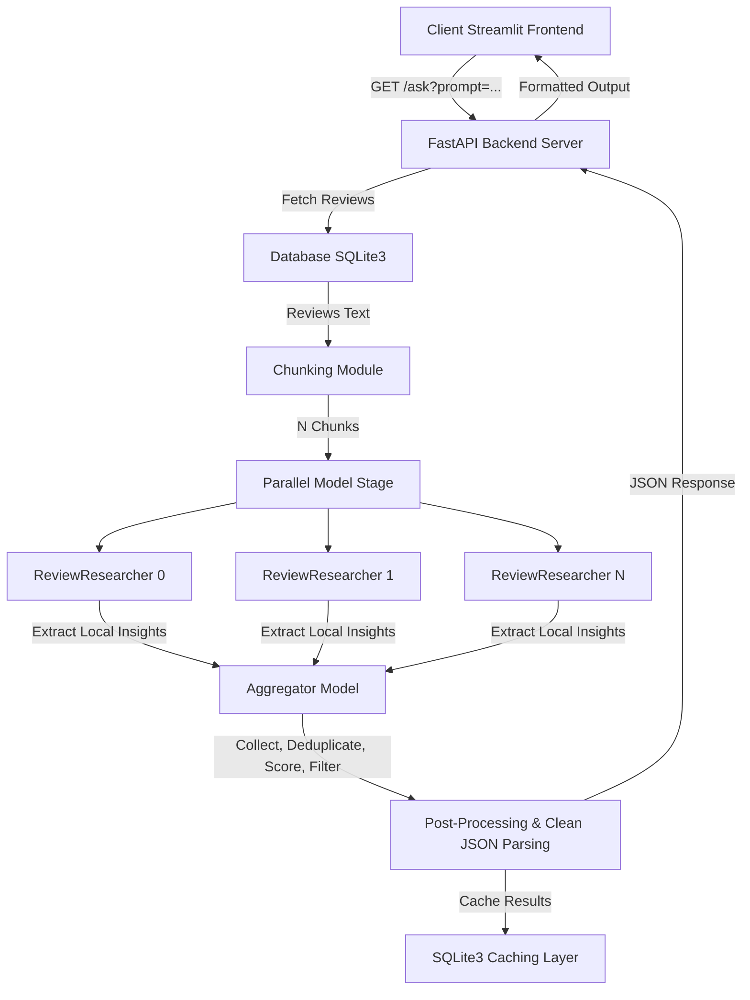

# Product Review Intelligence Platform (litmus7_project)

## The Problem
The immense volume of unstructured product reviews makes manual analysis inefficient for businesses seeking actionable insights.

## The Solution
- Instead of prompting an entire list of reviews, we use a **divide-and-conquer** approach.
- **Example**: For 1000 reviews, the system chunks the reviews into smaller chunks (e.g., 100 reviews each), and extracts the business-related context.
- These chunks are processed by parallel sub-agents of a root model.
- The root model then aggregates the results from the sub-agents and filters the data to ensure the best results and quality.

Below is the execution flow from the client request to the final response:



---

## Run Setup Guide

### 1. Create Environment (First Time)
```bash
python3 -m venv .venv
```

### 2. Activate the Environment
```bash
source .venv/bin/activate
```

### 3. Install Dependencies
```bash
pip install -r requirements.txt
```

### 4. Configure Environment (.env)
Configure the following variables in a `.env` file at the root of the project:
* `GROQ_API_KEY`: Your Groq API key (required for cloud model execution).
* `LOCAL_MODEL_NAME`: Main aggregator model (default: `groq/meta-llama/llama-4-scout-17b-16e-instruct`).
* `LOCAL_PARALLEL_MODEL_NAME`: Model for parallel sub-agents (default: `groq/meta-llama/llama-4-scout-17b-16e-instruct`).
* `LOCAL_CONCURRENCY_LIMIT`: Controls parallel API requests to prevent rate limits (default: `4`).
* `MAX_REVIEWS_TO_ANALYZE`: Maximum number of reviews to process at once (default: `100`).
* `MODEL_TEMPERATURE`: Optional temperature for the models (default: `0.0`).
* `MODEL_SEED`: Optional random seed for reproducible outputs (default: `42`).
* `MODEL_TOP_P`: Optional top_p value for model generation (default: `1.0`).
* `MODEL_MAX_TOKENS`: Max tokens for aggregator model (default: `8192`).
* `PARALLEL_MODEL_MAX_TOKENS`: Max tokens for parallel models (default: `4096`).

### 5. Start the FastAPI Backend
```bash
uvicorn app.main:app --reload
```

### 6. Start the Streamlit Frontend
```bash
streamlit run streamlit_app.py
```

### 🧠 Performance & Rate Limits
This pipeline is designed for massive datasets (2000+ reviews). It includes built-in rate-limit protections:
- **Batching & Cooldowns:** The rate limit manager enforces processing batches (e.g., 4 requests per batch) and automatically initiates a cooldown (e.g., 60 seconds) to safely remain under API limitations.
- **Concurrency Queues:** The `LOCAL_CONCURRENCY_LIMIT` ensures that only a set number of API requests run at exactly the same time, spreading out requests (with a 2s delay) to stay under Groq's Tokens-Per-Minute (TPM) limits.
- **Auto-Retries:** The pipeline leverages custom fallback logic and LiteLLM's retry policies to automatically back off and retry up to 5 times if Groq rate limits are hit, intelligently parsing Groq's "try again in X seconds" messages.
- **Clean Error Logging:** If a catastrophic rate limit is hit, the massive JSON stack traces are hidden from the console and safely saved to a `llm_error.log` file in the root directory for debugging.
