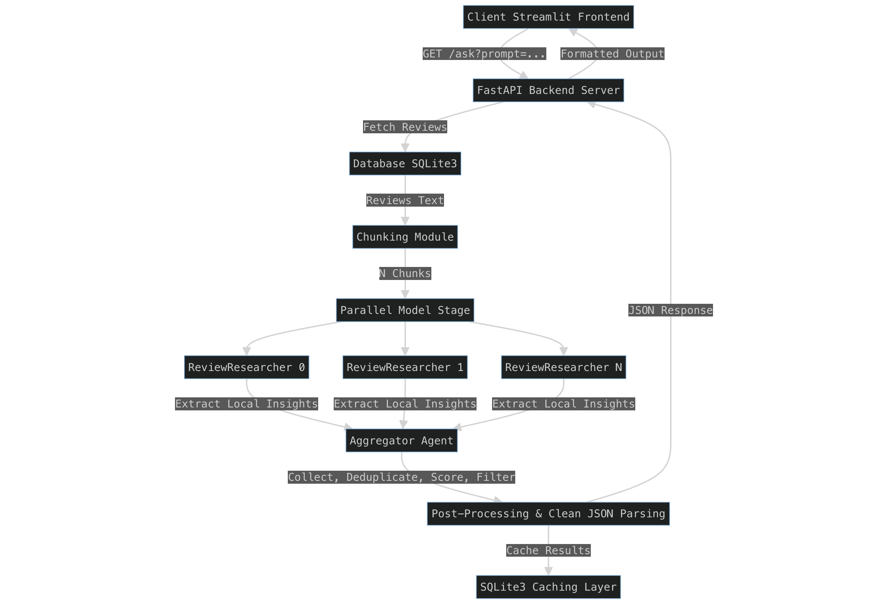

# Product Review Intelligence Platform (litmus7_project)

## The Problem
The immense volume of unstructured product reviews makes manual analysis inefficient for businesses seeking actionable insights.

## The Solution
- Instead of prompting an entire list of reviews, we use a **divide-and-conquer** approach.
- **Example**: For 1000 reviews, the system chunks the reviews into smaller chunks (e.g., 100 reviews each), and extracts the business-related context.
- These chunks are processed by parallel sub-agents of a root model.
- The root model then aggregates the results from the sub-agents and filters the data to ensure the best results and quality.



---

## Run Setup Guide

### 1. Create Environment (First Time)
```bash
python3 -m venv .venv
```

### 2. Activate the Environment
```bash
source .venv/bin/activate
```

### 3. Install Dependencies
```bash
pip install -r requirements.txt
```

### 4. Configure Environment (.env)
Configure the following variables in a `.env` file:
* `LOCAL_MODEL_NAME`: Main aggregator model (e.g., `openai/google/gemma-4-e4b`)
* `LOCAL_PARALLEL_MODEL_NAME`: Model for parallel sub-agents (e.g., `openai/google/gemma-4-e4b`)
* `LMSTUDIO_API_BASE`: Local server port (e.g., `http://localhost:1234/v1`)
* `LMSTUDIO_API_KEY`: `lm-studio`

### 5. Start Local LLM Server
1. Open **LM Studio** and start the Local Server on port `1234`.
2. Install/load the models:
   * `google/gemma-4-e4b` (highly recommended for Apple Silicon users; others use GGUF)
   * `google/gemma-4-e4b` (highly recommended for Apple Silicon users; others use GGUF)

#### IMPORTANT - Context Length Setup:
To ensure the models can process long reviews and complex JSON without getting cut off, adjust the Context Length:
1. In LM Studio, select your model and look at the right-side configuration panel.
2. Find **Context Length** (often under Advanced Configuration).
3. Increase the Context Length to at least `8192` (or `16384` if your Mac supports it).
4. Apply this setting for both the main aggregator model and the parallel sub-agent model.

Load the models you want to use. For local performance optimization, you can run a lightweight model for the parallel extraction sub-agents:
* `google/gemma-4-e4b`
* `google/gemma-4-e4b`

Load the models in LM Studio or using the CLI:
```bash
lms load google/gemma-4-e4b
lms load google/gemma-4-e4b
```

### 6. Run the FastAPI Backend
```bash
uvicorn app.main:app --reload
```

### 7. Run the Streamlit Frontend
```bash
streamlit run streamlit_app.py
```