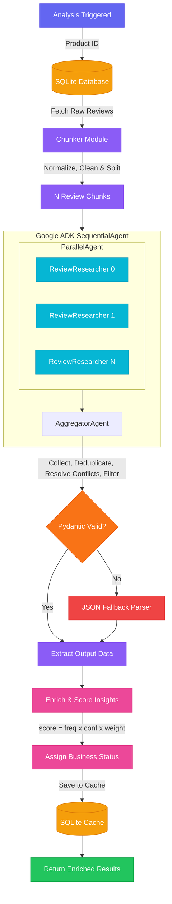

# 🤖 Product Review Intelligence Platform

> **Divide-and-conquer AI pipeline** that transforms thousands of unstructured product reviews into scored, prioritized business insights — powered by parallel LLM agents.

---

## 📌 The Problem

The immense volume of unstructured product reviews makes manual analysis inefficient for businesses seeking actionable insights. Traditional LLMs struggle with thousands of reviews due to context-window limits, hallucinations, and high token costs.

## 💡 The Solution

Instead of prompting an LLM with all reviews at once, this platform uses a **multi-agent divide-and-conquer** strategy:

1. **Chunk** — Reviews are normalized and split into manageable blocks (default: 200 per chunk).
2. **Analyze in Parallel** — Each chunk is assigned to an independent `ReviewResearcher` sub-agent that extracts localized insights.
3. **Aggregate** — A centralized `AggregatorAgent` synthesizes, deduplicates, resolves conflicts, and filters the combined findings.
4. **Score & Rank** — The Python backend calculates a weighted priority score and assigns a business status to every insight.

---

## 🏗️ Architecture



> **Rate Limit Protection:** All LLM calls pass through a custom Rate Limit Manager — batched processing (4 req/batch), 60s cooldowns, 2s inter-request delays, and intelligent retry parsing via LiteLLM.

---

## 📁 Project Structure

```
litmus7_project/
├── app/
│   ├── main.py                  # FastAPI app & lifespan setup
│   ├── database.py              # SQLAlchemy DB operations & caching
│   ├── core/
│   │   └── llm.py               # LiteLLM config, rate limit manager
│   ├── routers/
│   │   ├── products.py          # /products & /db/products endpoints
│   │   ├── reviews.py           # /reviews/{id} endpoints
│   │   └── insights.py          # /analyze/{id} & streaming endpoints
│   ├── schemas/
│   │   ├── Database_schema.py   # SQLAlchemy ORM models
│   │   └── insights.py          # Pydantic schemas & category weights
│   └── services/
│       ├── analysis_service.py  # Core pipeline orchestration
│       ├── parallel_agent.py    # ParallelAgent factory
│       ├── aggregator_agent.py  # AggregatorAgent factory
│       └── chunkers.py          # Text normalization & chunking
├── data/
│   └── litmus7.db               # SQLite database (products + reviews)
├── streamlit_app.py             # Streamlit frontend UI
├── requirements.txt             # Python dependencies
└── .env                         # Environment configuration
```

---

## 🔌 API Reference

| Method | Endpoint | Description |
|--------|----------|-------------|
| `GET` | `/db/products` | List all products with reviews |
| `GET` | `/db/product/{id}` | Get a specific product by ID |
| `GET` | `/reviews/{product_id}` | Get all reviews for a product |
| `POST` | `/reviews/{product_id}` | Add a review (auto-invalidates cache) |
| `GET` | `/analyze/{product_id}` | Run analysis pipeline (with caching) |
| `GET` | `/analyze/{product_id}/stream` | Stream analysis with real-time progress |
| `DELETE` | `/analyze/{product_id}/cache` | Clear cached analysis for a product |

---

## 🚀 Quick Start

### 1. Create & Activate Environment
```bash
python3 -m venv .venv
source .venv/bin/activate
```

### 2. Install Dependencies
```bash
pip install -r requirements.txt
```

### 3. Configure Environment (`.env`)
Create a `.env` file at the project root:
```env
GROQ_API_KEY=your_groq_api_key

# Models
LOCAL_MODEL_NAME=groq/meta-llama/llama-4-scout-17b-16e-instruct
LOCAL_PARALLEL_MODEL_NAME=groq/meta-llama/llama-4-scout-17b-16e-instruct

# Rate Limiting
LOCAL_CONCURRENCY_LIMIT=4

# Generation Config
MODEL_TEMPERATURE=0.0
MODEL_SEED=42
MODEL_TOP_P=1.0
MODEL_MAX_TOKENS=8192
PARALLEL_MODEL_MAX_TOKENS=4096
```

### 4. Launch
```bash
# Terminal 1 — Backend
uvicorn app.main:app --reload

# Terminal 2 — Frontend
streamlit run streamlit_app.py
```

---

## 🧠 Performance & Rate Limits

This pipeline is designed for massive datasets (2000+ reviews). Built-in protections include:

| Protection | Description |
|------------|-------------|
| **Batching & Cooldowns** | 4 requests per batch with automatic 60-second cooldowns between batches |
| **Concurrency Queues** | `LOCAL_CONCURRENCY_LIMIT` caps simultaneous API calls with 2s inter-request delays |
| **Auto-Retries** | Up to 5 retries with intelligent parsing of Groq's `"try again in X seconds"` messages |
| **Error Logging** | Rate limit stack traces are suppressed from console and saved to `llm_error.log` |
